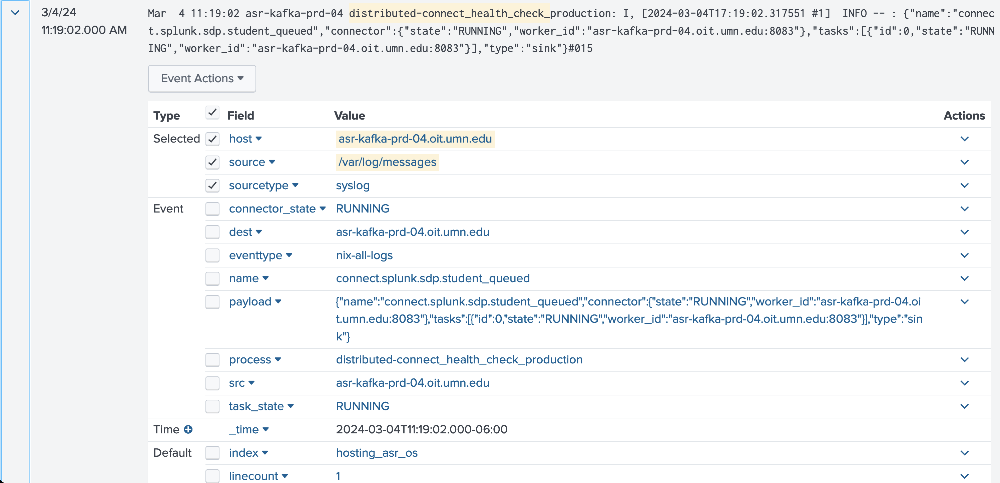

theme: Next, 8
footer: `https://z.umn.edu/splunk_data_presentation`

# Getting Data Into Splunk
## The What and The How

Ian Whitney<br>ASR Data Engineering<br>he/his

---

## Splunk
### What Is It

> software for searching, monitoring, and analyzing machine-generated data

---

## Splunk
### What Do We Use It For

- Ensuring our applications are healthy
- Alerts
- Dashboards
- Research when things go awry

---

## Splunk

[.column]

### Today's Topics

- Generation of data
- Ingestion of data

[.column]

### Another Time

- Working with data in Splunk

---

## Generation
### Options
- Application logs
- Instrumentation
- API responses
- Database queries
- Server metrics

---

## Generation
### General Advice

---

#### [fit] More structured = better
#### [fit] More identifiers = better

---

## Generation
### Application Logs

---

## Generation
### Application Logs

- A sensible place to start
- You probably already have these
- Write them in JSON if you can

---

## Generation
### Application Logs

```
Mar 05 08:23:01 asr-kafka-qat-04.oit.umn.edu docker-compose[130842]: distributed-connect    | \
[2024-03-05 14:23:01,561] INFO 192.168.96.1 - - [05/Mar/2024:14:23:01 +0000] \
"GET /connectors/non_credit_registration.sub_offerings/status HTTP/1.1" 200 229 "-" "Ruby" 0 \
(org.apache.kafka.connect.runtime.rest.RestServer)
```

---

## Generation
### Instrumentation

---

## Generation
### Instrumentation
- Offered by many application frameworks 
- Write code to to observe code

---

## Generation
### Instrumentation


```ruby
ActiveSupport::Notifications.instrument "your_application.magic" do |instrumentation|
  # magic happens
end
```

---
## Generation
### Instrumentation


```json
{
    "severity": "INFO",
    "timestamp": 1707750727997393,
    "program": "your_application",
    "environment": "production",
    "version": "0.0.40",
    "entry": {
        "string": null,
        "instrumentation": {
            "name": "your_application.magic",
            "started": 1707750727992772,
            "finished": 1707750727997335,
            "elapsed": 4563
        }
    }
}
```

---

## Generation
### API Responses

---

## Generation
### API Responses
- Health checks, status, etc
- These usually return JSON

---

## Generation
### API Responses

```
curl -H "Content-Type: application/json" \
-X GET \
"http://127.0.0.1:8088/healthcheck"
```

---

## Generation
### API Responses

```json
{
    "isHealthy": true,
    "details": {
        "metastore": {
            "isHealthy": true
        },
        "kafka": {
            "isHealthy": true
        },
        "commandRunner": {
            "isHealthy": true
        }
    },
    "serverState": "READY"
}
```

---

## Generation
### Database Queries

---

## Generation
### Database Queries
- Databases contain data and metadata that you can track
- SQL queries can return JSON

---
## Generation
### Database Queries

```sql
SELECT /*json*/
    max(updated_at) as most_recent_update
FROM
    important_application_table
;
```

---
## Generation
### Database Queries

```json
{
    "most_recent_update": 1707750727992772
}
```

---

## Generation
### Server Metrics

---

## Generation
### Server Metrics
- Ask the server how it's doing
- A lot of data from hosts is already in Splunk
    - `top`
    - `cpu`
    - `vmstat`
    - `syslog`

---

## Ingestion

---

## Ingestion
### Options
- Have the Splunk team do it
- Use methods that already exist, `syslog`
- Send it yourself, `HEC`
- Other (secretly also `HEC`)
- Other Other (OpenTelemetry, JMX, etc.)

---

## Ingestion
### Have the Splunk team do it

---

## Ingestion
### Have the Splunk team do it

- Work with the Splunk team
- Format your files a consistent way
- Store your files in a consistent location

---

## Ingestion
### Have the Splunk team do it

- Requires fewer changes on your side
- Slower. Splunk team is super busy!
- Can require you to remember to add new hosts to Splunk ingestion

---


---

## Ingestion
### Use methods that already exist, `syslog`

---

## Ingestion
### Use methods that already exist, `syslog`

- Splunk already ingests host log data
- Easy to set up if you run your process in
    - `systemd`
    - Docker
- Be sure to add unique and helpful tags

---

## Ingestion
### Use methods that already exist, `syslog`

- Ingestion is out of your control
- Written alongside a _ton_ of other messages, can be noisy

---



---

## Ingestion
### Send it yourself, `HEC`

---

## Ingestion
### Send it yourself, `HEC`

- Get a token from the Splunk team
- Send your data over http

---

## Ingestion
### Send it yourself, `HEC`

- Code for you to manage
- Sometimes HTTP fails

---


---

## Ingestion
### Other (secretly also `HEC`)

---

## Ingestion
### Other (secretly also `HEC`)

- Boomi
- Kafka
- Etc

---

## Ingestion
### Other (secretly also `HEC`)

- Allows you to integrate services in to Splunk
- Without managing all the integration code

--- 


---

## Ingestion
### Other Other (OpenTelemetry, JMX, etc)

- Splunk offers connectors that ingests these things
- Ask the Splunk team!

---

# Mix And Match

[.column]

## Generation
- Application logs
- Instrumentation
- API responses
- Database queries
- Server metrics

[.column]

## Ingestion
- Have the Splunk team do it
- Use methods that already exist, `syslog`
- Send it yourself, `HEC`
- Other (secretly also `HEC`)

---

# [fit] Questions
